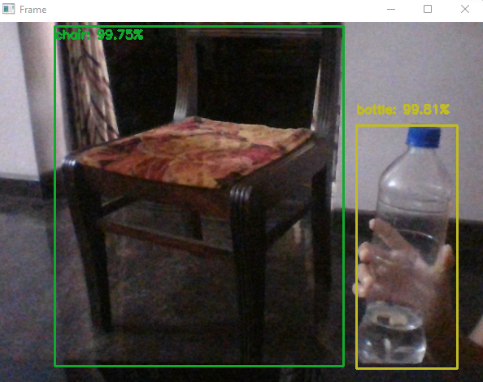

<h1 align="center">Real-Time Object Detection</h1>
<h3 align="center">Using OpenCV and Python</h3>

## How this project was implemented
This project was implemented using OpenCv and Python. I have used YOLOv3 which is trained on Coco dataset.
